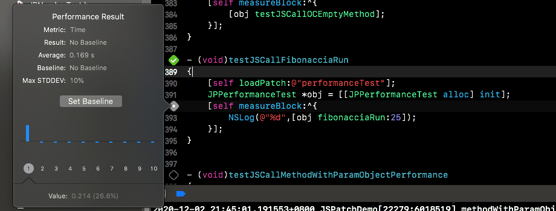
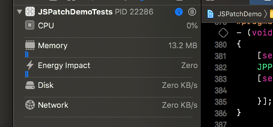
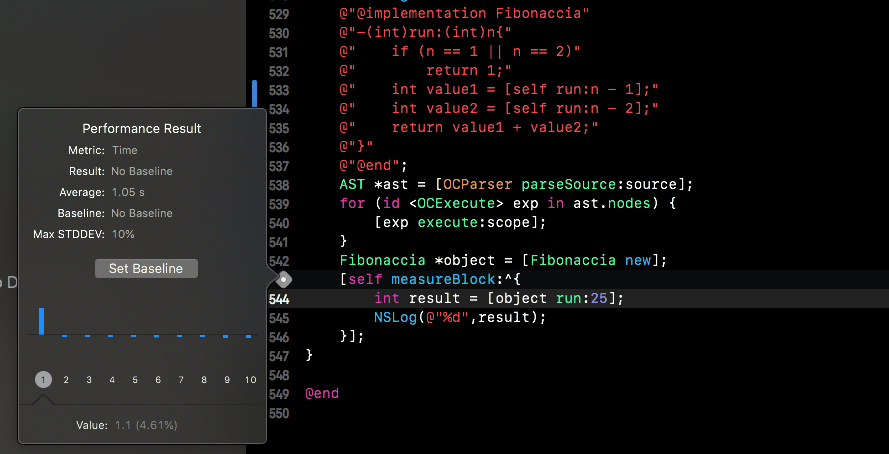
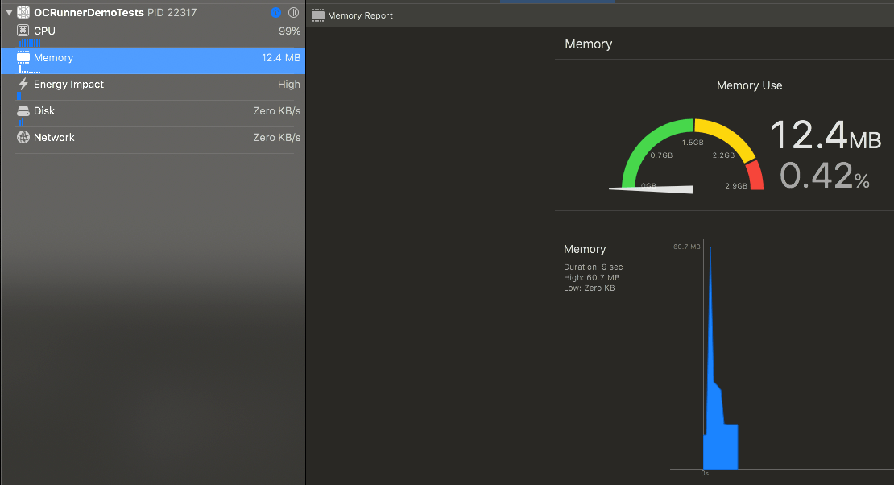
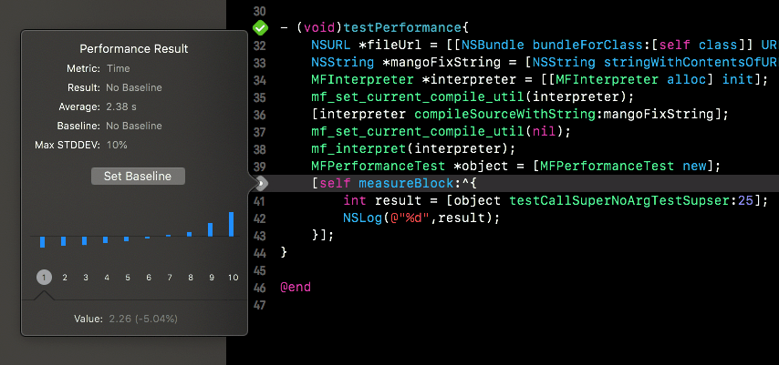
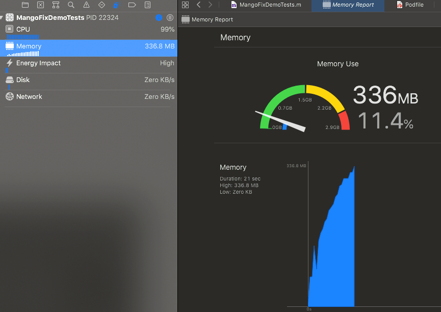

**OCRunner QQ群: 860147790**

[中文介绍](https://github.com/SilverFruity/OCRunner/blob/master/README-CN.md)

[相关文章](https://github.com/SilverFruity/OCRunner/issues/11)

[Wiki](https://github.com/SilverFruity/OCRunner/wiki)

## Introduction

### The work flow of using [OCRunner](https://github.com/SilverFruity/OCRunner) to generate a patch 


### Responsibilities of all parties

* [oc2mangoLib](https://github.com/SilverFruity/oc2mango/tree/master/oc2mangoLib) is equivalent to a simple compiler, responsible for generating the abstract syntax tree.
* [ORPatchFile](https://github.com/SilverFruity/oc2mango/tree/master/oc2mangoLib/PatchFile) is responsible for serializing and deserializing the abstract syntax tree and determining whether the version is available.
* [PatchGenerator](https://github.com/SilverFruity/oc2mango/tree/master/PatchGenerator) is responsible for integrating the functions of oc2mangoLib and ORPatchFile. (All the above tools are in the [oc2mango](https://github.com/SilverFruity/oc2mango) project).
* [OCRunner](https://github.com/SilverFruity/OCRunner) is responsible for executing the abstract syntax tree.

### Difference from other hotfix libraries

* Use binary patch files. Increase security, reduce patch size, optimize startup time, and can be optimized in the PatchGenerator stage.

* Custom Arm64 ABI （You can also choose to use libffi）

* Complete Objective-C syntax support, but does not support pre-compilation and partial syntax.

## Run patches locally using OCRunner

[OCRunnerDemo](https://github.com/SilverFruity/OCRunner/tree/master/OCRunnerDemo) can be used as a reference for the entire process.

###  Cocoapods

```ruby
pod 'OCRunner'      #Support all architectures, including libffi.a
# or
pod 'OCRunnerArm64' #Only supports arm64 and arm64e, does not include libffi.a
```

### Download [PatchGenerator](https://github.com/SilverFruity/oc2mango/releases)

Unzip PatchGenerato.zip, then save **PatchGenerator** to /usr/local/bin/ or the project directory.

### add `Run Script`  of PatchGenerator 

1. **Project Setting** -> **Build Phases** -> click  `+`  in the upper left corner -> `New Run Script Phase`

2. [Path to PatchGenerator file]  **-files** [Objective-C source files or diretory] **-refs** [Objective-C header files or diretory]  **-output**  [Path to save the patch]

3. for example:  `Run Script` in OCRunnerDemo

   ```shell
   $SRCROOT/OCRunnerDemo/PatchGenerator -files $SRCROOT/OCRunnerDemo/ViewController1 -refs  $SRCROOT/OCRunnerDemo/Scripts.bundle -output $SRCROOT/OCRunnerDemo/binarypatch
   ```

### Development environment:  Execute patch file

1. Add the generated patch file as a resource file to the project.

2. Appdelegate.m

```objc
- (BOOL)application:(UIApplication *)application didFinishLaunchingWithOptions:(NSDictionary *)launchOptions {
#if DEBUG
    NSString *patchFilePath = [[NSBundle mainBundle] pathForResource:@"PatchFileName" ofType:nil];
#else
   // download from server
#endif
    [ORInterpreter excuteBinaryPatchFile:patchFilePath];
    return YES;
}
```

3. Every time you modify the file, remember to use **Command+B**, call `Run Scrip` to regenerate the patch file.


### Online environment

1. Upload the patch to the resource server.
2. Download and save the patch file in the App.
3. Use **[ORInterpreter excuteBinaryPatchFile:PatchFilePath]** to execute the patch.


## Use introduction


### Structure, Enum, Typedef

You can run the following code by modifying **ViewController1** in **OCRunnerDemo**.

```objc
// A new type called dispatch_once_t will be added
typedef NSInteger dispatch_once_t;
// link NSLog
void NSLog(NSString *format, ...);

typedef enum: NSUInteger{
    UIControlEventTouchDown                                         = 1 <<  0,
    UIControlEventTouchDownRepeat                                   = 1 <<  1,
    UIControlEventTouchDragInside                                   = 1 <<  2,
    UIControlEventTouchDragOutside                                  = 1 <<  3,
    UIControlEventTouchDragEnter                                    = 1 <<  4
}UIControlEvents;

int main(){
    UIControlEvents events = UIControlEventTouchDown | UIControlEventTouchDownRepeat;
    if (events & UIControlEventTouchDown){
        NSLog(@"UIControlEventTouchDown");
    }
    NSLog(@"enum test: %lu",events);
    return events;
}
main();
```

**Tips:** 

It is recommended to create a new file to place the above code, similar to the UIKitRefrence and GCDRefrence files in OCRunnerDemo, and then add the patch generation in the form of **-links**.


### Use system built-in C functions

```objc
//you only need to add the C function declaration in Script.
//link NSLog
void NSLog(NSString *format, ...);

//then you can use it in Scrtips.
NSLog(@"test for link function %@", @"xixi");
```

You can run the code by changing the content of **ViewController1** in OCRunnerDemo.

When you add this code in scripts. OCRunner will use `ORSearchedFunction` to search the pointer of function name. It's core is `SymbolSearch` (edit from fishhook).

If the searched result of function name is NULL，OCRunner will notice you in console like this:

```objc
|----------------------------------------------|
|❕you need add ⬇️ code in the application file |
|----------------------------------------------|
[ORSystemFunctionTable reg:@"dispatch_source_set_timer" pointer:&dispatch_source_set_timer];
```

### Fix Objective-C 's object (class) method and add attributes

If you want to fix a method, you can reimplement the method without implementing other methods.


```objc
@interface ORTestClassProperty:NSObject
@property (nonatomic,copy)NSString *strTypeProperty;
@property (nonatomic,weak)id weakObjectProperty;
@end
@implementation ORTestClassProperty
- (void)otherMethod{
    self.strTypeProperty = @"Mango";
}
- (NSString *)testObjectPropertyTest{
  	[self ORGtestObjectPropertyTest] // Add'ORG' before the method name to call the original method
    [self otherMethod];
    return self.strTypeProperty;
}
@end
```


### Use of Block and solve circular references

```objc
__weak id object = [NSObject new];
// Minimal block
void (^a)(void) = ^{
    int b = 0;
};
a();
```


### Use GCD

Its essence is **Use system built-in C functions**. It is added through the **GCDRefrences** file in OCRunnerDemo. The GCD related function declaration and typedef are all included in it.

For Example:

```objc
// link dispatch_sync
void dispatch_sync(dispatch_queue_t queue, dispatch_block_t block);
void main(){
  dispatch_queue_t queue = dispatch_queue_create("com.plliang19.mango",DISPATCH_QUEUE_SERIAL);
	dispatch_async(queue, ^{
   	completion(@"success");
	});
}
main();
```


### Use inline functions, precompiled functions

```objc
// Inline function: just add a global function in the patch, such as `CGRectMake` in UIKitRefrences
CGRect CGRectMake(CGFloat x, CGFloat y, CGFloat width, CGFloat height)
{
  CGRect rect;
  rect.origin.x = x; rect.origin.y = y;
  rect.size.width = width; rect.size.height = height;
  return rect;
}
// Pre-compiled function: you need to add the following code in the App
[[MFScopeChain top] setValue:[MFValue valueWithBlock:^void(dispatch_once_t *onceTokenPtr,
                                                                  dispatch_block_t _Nullable handler){
        dispatch_once(onceTokenPtr,handler);
    }] withIndentifier:@"dispatch_once"];
```

### How to determine if source files are included in a patch


## Performance Testing

### Loading time


### Execution speed and memory usage

Device:  iPhone SE2 , iOS 14.2,  Xcode 12.1.

Take the classic Fibonacci sequence function as an example, find the test result of the value of the 25th term

#### JSPatch

* Execution time, the average time is 0.169s

  

* Memory usage has been stable at around 12MB




#### OCRunner
* Execution time, the average time is 1.05s

  

* Memory usage, peak value is about 60MB




#### Mango
* Execution time, the average time is 2.38s

  

* The memory usage continues to rise, reaching about 350MB at the highest point.




* When testing with recursive functions, the performance of OCRunner is 1/5 times JSPatch's, and is 2.5 times Mango's.
* OCRunner's patch loading speed is about 20 times + that of Mango, and this value increases as the patch size increases.  and the result of JSPatch is unknown.
* Regarding the memory usage of recursive method calls, there is currently a problem of excessive usage. When finding the 30th item of the Fibonacci sequence, Mango will burst the memory, and the peak memory usage of OCRunner is about 600MB.


## Current problems

1. Pointer and multiplication sign identification conflicts, derived problems: type conversion, etc.
2. Not support static、inline function declaration
3. Not support C array declaration:  type a[]、type a[2]、value = { 0 , 0 , 0 , 0 }
4. Not support '->' operation symbol...
5. Not support fix C function 


## Support grammar

1. Class declaration and implementation, support Category
2. Protocol
3. Block
4. struct、enum、typedef
5. Use function declarations to link system function pointers
6. Global function
7. Multi-parameter call (methods and functions)
8. **\***、**&**  (Pointer operation)
9. Variable static keyword
10. NSArray: @[value1, value2]，NSDictionary: @{ key: value },  NSNumer:  @(value)
11. NSArray, NSDictionary value and assignment syntax: id value = a[var];  a[var] = value;
12. [Operator, except for'->' all have been implemented](https://baike.baidu.com/item/%E8%BF%90%E7%AE%97%E7%AC%A6%E4%BC%98%E5%85%88%E7%BA%A7/4752611?fr=aladdin)

etc.


### Thanks for
* [Mango](https://github.com/YPLiang19/Mango)
* [libffi](https://github.com/libffi/libffi)
* Procedure Call Standard for the ARM 64-bit Architecture. 
* [@jokerwking](https://github.com/jokerwking)
